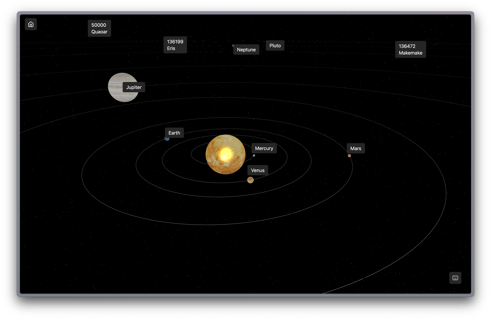
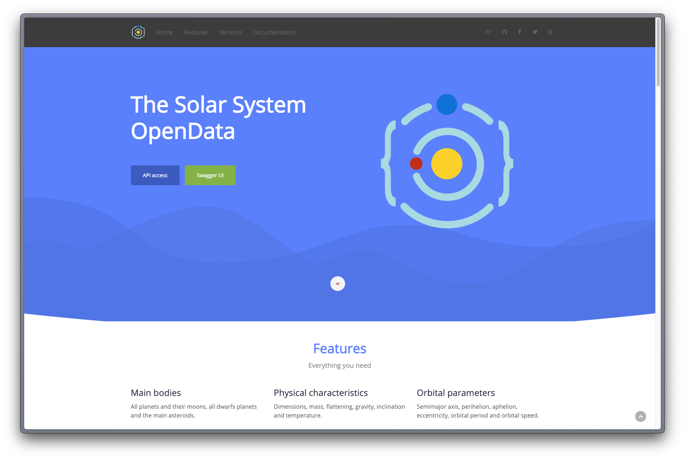
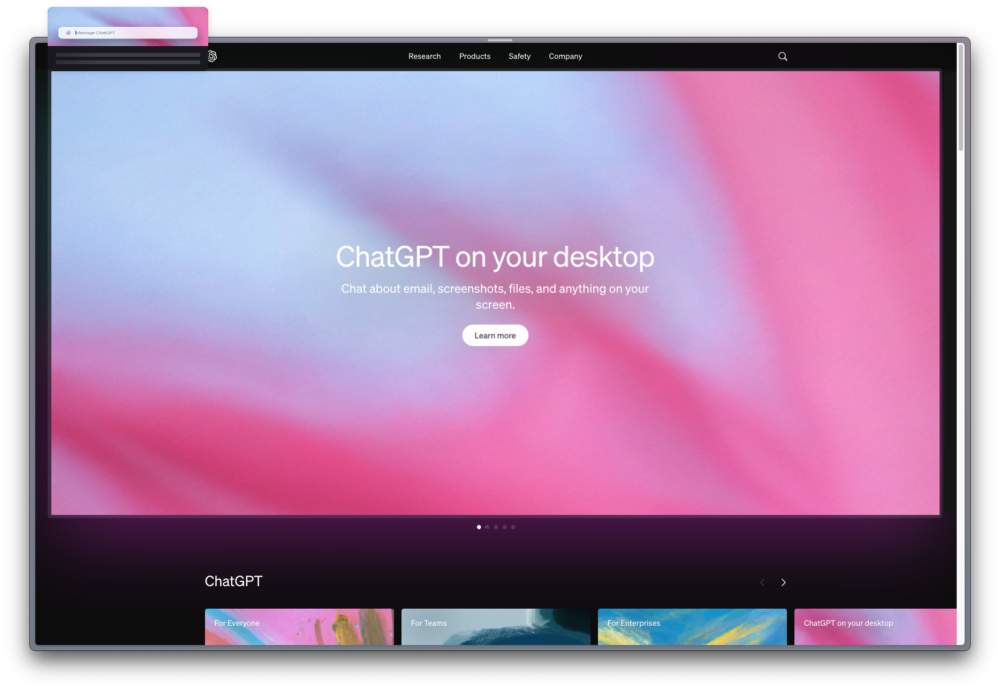
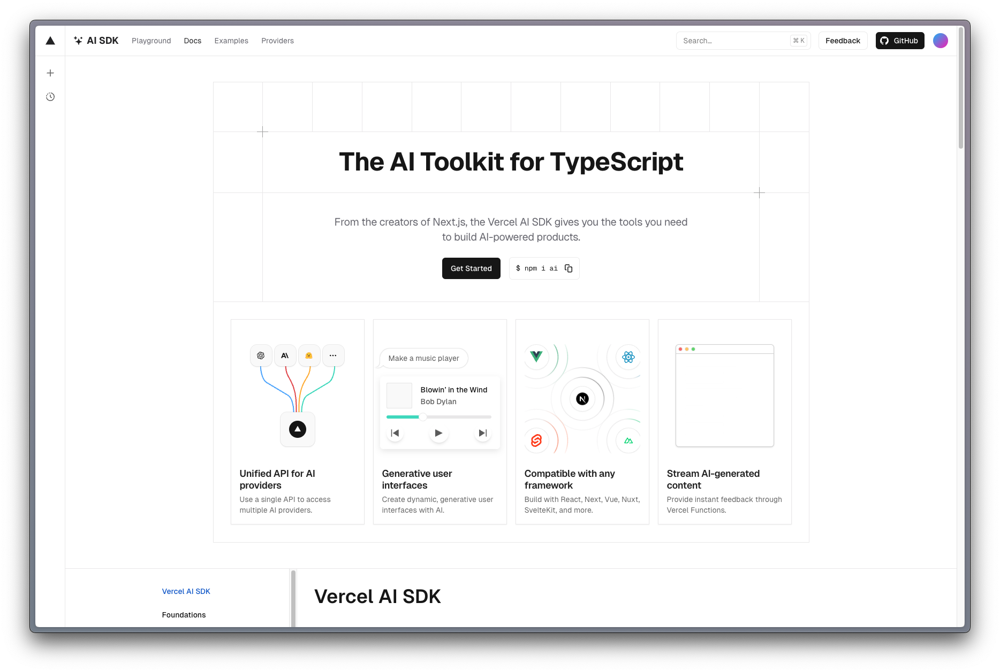

# 3D Solar System experience 🛰️👨‍🚀

Visit the live site under: [3D Solar System Experience](https://3d-solar-system-experience.vercel.app) ⬅️

### About the Project

---

This is a university project. The goal was to create an 3d solar experience using Three.js and SvelteKit that showcases the solar system with its planets and moons. I also added an AI chat functionality to provide even more information about specific planets.

### Features

- [x] 🌐 3D Interactive Solar System
- [x] 📶 Realtime Data from API
- [x] 🪄 Furhter Information with AI Chat
- [x] 🌓 Detail View for Planets including Moons
- [x] 📲 Reponsiveness

### API's used

<b>Solar and Planet Data: </b>
I used the Le Systeme Solaire API to get the data for the solar system. You can check out the API here:
[Solar API](https://api.le-systeme-solaire.net/rest/bodies)
<br/>


To provide even more information about specific planets, I used the OpenAI API to generate text based on the data provided by the Le Systeme Solaire API. You can check out the API here:
[Open AI](https://platform.openai.com/docs/api-reference/chat)


I also used the Vercel [AI SDK](https://sdk.vercel.ai/docs/introduction) to stream the text generated by the OpenAI API.


### Tech Stack

---

- [SvelteKit](https://svelte.dev/)
- [Threlte](https://threlte.xyz/)
- [Typescript](https://www.typescriptlang.org/)
- [Tailwind CSS](https://tailwindcss.com/)
- [Vercel AI SDK](https://sdk.vercel.ai/docs/introduction)
- [ShadcnUISvelte](https://www.shadcn-svelte.com/)
- [OpenAI](https://platform.openai.com/docs/api-reference/chat)

---

## How it works

1. Clone the Repo
2. Replace the `.env.example` file with a `.env.local` file in your root directory and replace your OpenAI API key.

```
OPENAI_API_KEY=YOUR_API_KEY
```

3. Install all the dependecies using pnpm install

```
pnpm install
```

4. Start the Development Sever with pnpm run dev

```
pnpm run dev
```
